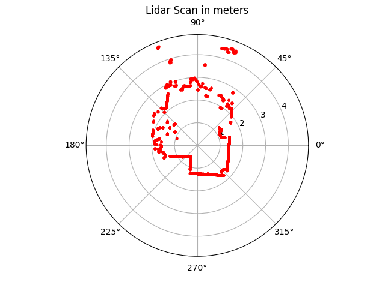
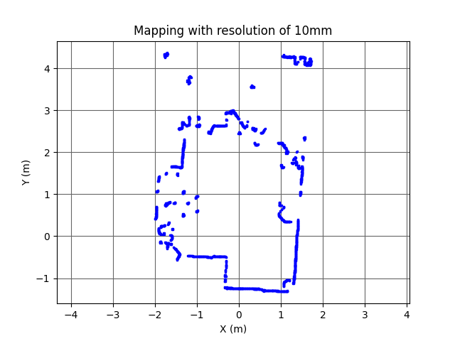

# S.L.A.M. (Simultaneous Localization and Mapping) Experiment

This is a working experiment to create a basic SLAM robot using a RPLidar A1 and a Raspberry Pi (or Beaglebone), with the goal of creating a map of a room.

## Roadmap

- [x] Get Lidar working plugged into computer (UART communication via USB)
- [x] Create basic python server using Flask to get Lidar data from robot program and plot it
  - [x] Create very simple polar and cartesian map of lidar data
  - [x] Upload to server and save plots, server via Flask to webpage
- [ ] Motorized car setup
  - [ ] Car motor controller
  - [ ] Battery and power management
  - [ ] Raspeberry Pi/Beaglebone connected to lidar and motor controller
  - [ ] Bluetooth remote controller for car (posssibly ignore this for now)
- [ ] Create basic SLAM algorithm
  - [ ] More research on SLAM algorithms
  - [ ] Create basic SLAM algorithm
- [ ] Who knows what else...

## Resources

- RPLIDAR

  - [Slamtec RPLidar A1](https://www.slamtec.com/en/Lidar/A1/)
  - [OpenGL LIDAR Display (good example RPLidar project)](https://github.com/jasonacox/OpenGL-LIDAR-Display)
  - [RPLIDAR SDK](https://github.com/Slamtec/rplidar_sdk)

- SLAM
  - [Simultaneous Localization and Mapping (Wikipedia)](https://en.wikipedia.org/wiki/Simultaneous_localization_and_mapping)
  - [SLAM for Dummies (PDF)](https://dspace.mit.edu/bitstream/handle/1721.1/119149/16-412j-spring-2005/contents/projects/1aslam_blas_repo.pdf)
  - [Simultaneous Localisation and Mapping (SLAM):
    Part I The Essential Algorithms (PDF)](https://people.eecs.berkeley.edu/~pabbeel/cs287-fa09/readings/Durrant-Whyte_Bailey_SLAM-tutorial-I.pdf)

## Map Display Plots

By default the python server will serve a website on port 8080, which can be used to view the map plots. The plots are generated via matplotlib and saved to the `static` folder, and the website will display the most recent plot.

